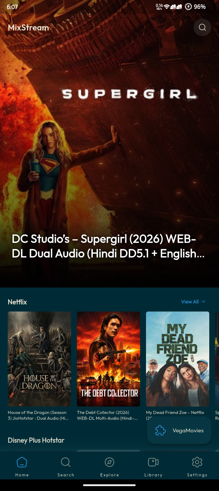
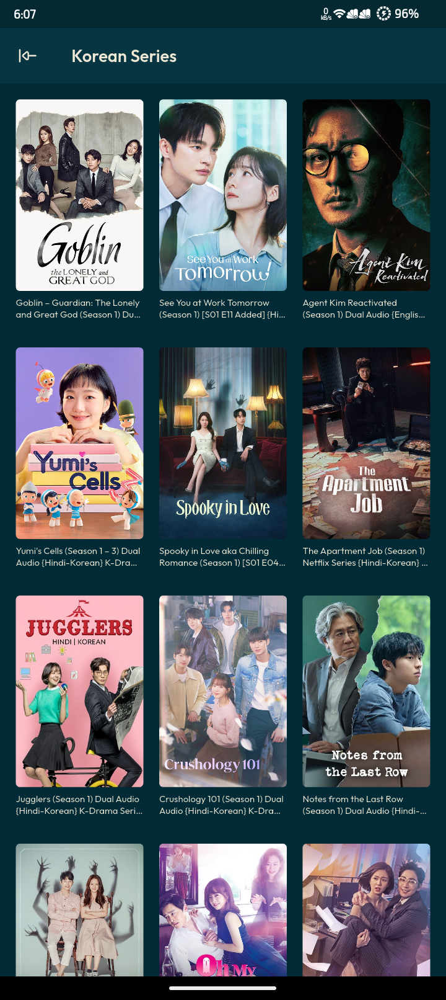
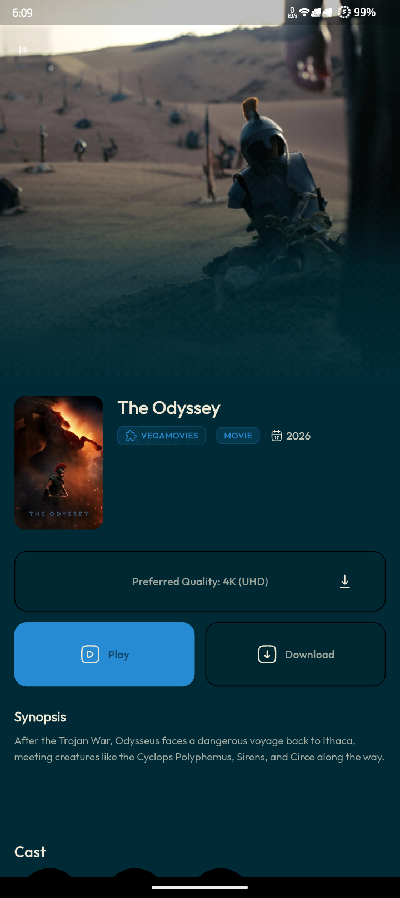
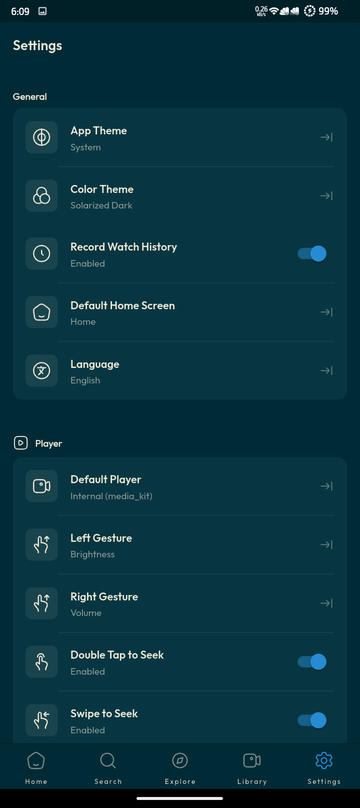

# MixStream

<div align="center">
    
    <h2>MixStream</h2>
</div>

<div align="center">
  <a href="https://github.com/alwayszihanx/mixstream/releases">
    
  </a>
  <a href="https://github.com/alwayszihanx/mixstream/stargazers">
    
  </a>
  <a href="https://github.com/alwayszihanx/mixstream/releases">
    
  </a>
  <a href="https://github.com/alwayszihanx/mixstream/issues">
    
  </a>
  <a href="https://github.com/alwayszihanx/mixstream/issues?q=is%3Aissue+is%3Aclosed">
    
  </a>
  <a href="https://github.com/alwayszihanx/mixstream/commits/main">
    
  </a>
</div>

<p align="center">
  <br>
  <strong>A modern, cross-platform media streaming client inspired by CloudStream</strong>
  <br>
</p>

<div align="center">

**⚠️ Important Warning**: By default, this app doesn't provide any video sources; you have to install extensions to add functionality to the app.

> **Note**: This project is an independent application built with Flutter. While it supports similar extension formats, it is a simplified, modern re-imagining and is **not** a direct clone or fork of the official CloudStream client.

**Please don't create illegal extensions or use any that host any copyrighted media.** This project does not condone copyright infringement.

</div>

## 🚀 Key Features

- 📱 **Cross-platform**: Android, Android TV, iOS, Windows, macOS, Linux
- 🔌 **Plugin-based architecture** with custom JavaScript engine
- 🔍 **Powerful search & discovery** with TMDB integration
- 🌐 **Multi-provider support** with domain switching
- 🎬 **Advanced streaming controls** - playback speed, resume, quality selection
- 🔗 **Multi-tracker sync** - Trakt, Simkl, MAL, AniList
- 🌍 **40+ languages** with smart skip (Intro/Outro) support
- 📺 **Live streaming** with improved reliability
- ⏱️ **Offline viewing** with download support

## 🛠️ Built With

<p align="center">
  
  
  
  
  
</p>

## 📱 Supported Platforms

| Platform       | Support          |
|:-------        |:----------------:|
| **Android**    | ✅                |
| **Windows**    | ✅                |
| **Linux**      | ✅                |
| **Android TV** | ⏳ Coming soon    |
| **iOS**        | ⏳ Coming soon    |
| **macOS**      | ⏳ Coming soon    |

## 🎨 Screenshots

### 📱 Mobile

<p align="center">
  
  
  
  
</p>

### 📺 Large Screen

<p align="center">
  
  
</p>

## 📥 Installation

### 🤖 Android

Download the latest APK from the **[Releases page](https://github.com/alwayszihanx/mixstream/releases/latest)** and install it on your device.

### 🐧 Linux

**⚡ One-command install (app + all MixPlug plugins):**

```bash
curl -fsSL https://raw.githubusercontent.com/alwayszihanx/MixStream/main/installer.sh | sudo bash
```

This installs MixStream **and** automatically installs all plugins from the MixPlug repository, so extensions are ready on first launch.

**🗑️ One-command uninstall:**

```bash
curl -fsSL https://raw.githubusercontent.com/alwayszihanx/MixStream/main/uninstaller.sh | sudo bash
```

The installer automatically uses the local bundle if available, or downloads it from GitHub Releases.

### 💻 Windows

1. Download `mixstream.exe` from Releases
2. Install and run the application

### 🍏 iOS / macOS

Coming soon...

## 🛠️ Build from Source

```bash
git clone https://github.com/alwayszihanx/mixstream.git
cd mixstream
flutter pub get
flutter gen-l10n
dart run build_runner build --delete-conflicting-outputs
flutter run
```


## 📚 Learn More

- **GitHub Issues**: Report bugs or request features
- **Translation Guide**: Help with localization
- **Extension Guide**: Build your own plugins

## 🤝 Contributing

We welcome all kinds of contributions! Whether fixing bugs or adding features.

## 📊 Project Stats

<div align="center">


</div>
