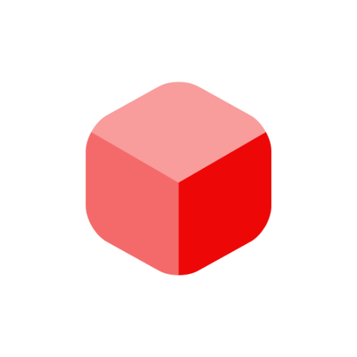
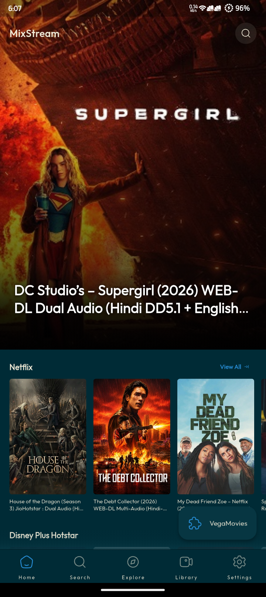
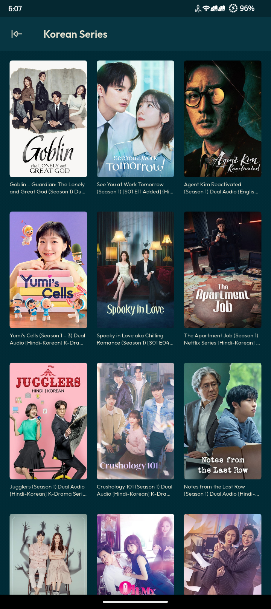
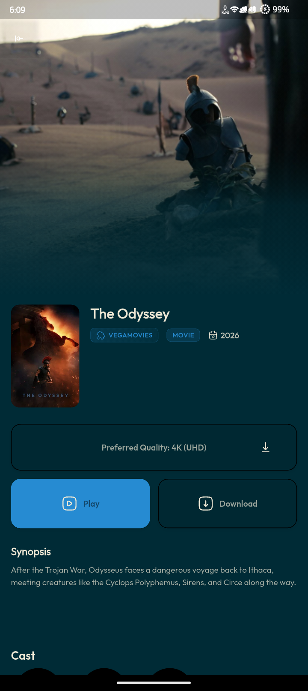
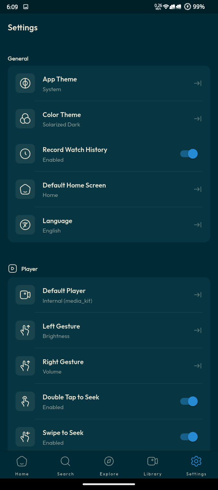

# MixStream

<div align="center">
    
    <h2>MixStream</h2>
</div>

<div align="center">
  <a href="https://github.com/alwayszihanx/mixstream/releases">
    
  </a>
  <a href="https://github.com/alwayszihanx/mixstream/stargazers">
    
  </a>
  <a href="https://github.com/alwayszihanx/mixstream/releases">
    
  </a>
  <a href="https://github.com/alwayszihanx/mixstream/issues">
    
  </a>
  <a href="https://github.com/alwayszihanx/mixstream/commits/main">
    
  </a>
</div>

<p align="center">
  <br>
  <strong>A modern, cross-platform media streaming client inspired by CloudStream</strong>
  <br>
</p>

<div align="center">

**⚠️ Important Warning**: By default, this app doesn't provide any video sources; you have to install extensions to add functionality to the app.

> **Note**: This project is an independent application built with Flutter. While it supports similar extension formats, it is a simplified, modern re-imagining and is **not** a direct clone or fork of the official CloudStream client.

**Please don't create illegal extensions or use any that host any copyrighted media.** This project does not condone copyright infringement.

</div>

## ✨ Highlights (v3.7.1)

- 📥 **Batch episode download** — select episodes and download a whole season at once, with "Select all (N)" / "This page", skip-already-downloaded, and parallel resolution so long batches finish fast.
- 🎬 **Real MKV downloads** — every download is remuxed from MP4 into a genuine `.mkv` by a pure-Dart remuxer (no FFmpeg, no quality loss, A/V sync preserved), with live conversion progress.
- 📡 **HLS support** — `.m3u8` sources are downloadable, including **AES-128 encrypted** playlists, with live streams rejected cleanly.
- 🏠 **14 regional shelves** — Latest, Hollywood, Bollywood, South Indian, Indonesian, Korean, Turkish, British, French, German, Russian, Chinese, Japanese and Arabic. Filtered by real industry origin, sorted newest-first so new releases show up automatically.
- 🎬 **Nuvio batch download** — Nuvio scraper sources are now resolvable for batch downloads, scraper cookies carry through to the download (fixing 403s that playback didn't hit), and sources rank by how often each scraper has actually delivered.
- ✅ **Downloaded progress** — a "3 of 12 downloaded" badge per season, and the converted MKV is preferred over the MP4 it replaced.

## ✨ Highlights (v3.6.9)

- 🎬 **Poster zoom overlay** — double-tap any poster to zoom with a floating action menu (Play, Bookmark, Download) for quick access without leaving the screen.
- 📺 **Scroll-driven hero stretch** — the hero poster stretches and compresses as you scroll, giving a cinematic parallax depth effect on desktop/TV.
- 🔄 **Watched progress tracking** — per-episode tracking with mark watched/unwatched, season-wide actions, and automatic detection based on playback position (90% threshold).
- 📡 **Network offline card** — persistent connectivity indicator banner at the top of the details screen, auto-updating in real-time.
- 🏠 **Continue Watching Hero Slot** — hero-sized carousel at the top of the home screen for instant access to where you left off.
- ✅ **Error & empty states** — friendly error view with retry button and empty state instead of raw error text; graceful fallback when no provider matches.
- 🎬 **Nuvio integration** — improved metadata handling, plugin sources sheet, and debrid integration for premium link resolution.
- 🎨 **Cinematic details page** — rounded parallax hero card, floating glass action panel, a prominent circular back button, and a two-panel editorial layout for desktop/TV.
- 🧭 **Floating pill navigation** — a gradient pill-shaped nav bar with glowing active states; the widescreen sidebar uses a rounded 28px dock.
- 🏠 **First-run onboarding** — a 3-slide welcome flow introduces streaming, extensions, and offline downloads before the app opens.
- 📚 **Rebuilt Library tabs** — Continue Watching | My List | Downloads | Queue, with a smarter continue-watching feed (progress 0–98%).
- 🌞 **Solarized default theme** — fresh installs now boot into the curated Solarized theme.
- 🎨 **Design system polish** — 32px pill nav, rounded cards, gradient section accent bars, and consistent corner radii across the app.

## ✨ Highlights (v3.6.9)

- 🎬 **Cinematic 7-stage splash** the screen opens on pure black, an ambient green glow blooms, real genre posters (Horror, Thriller, Action, Sci-Fi, Anime, Drama, Comedy, Documentary) emerge from every direction and collapse into the **MixStream** logo, a light sweep glides across it, and it fades seamlessly into the app.
- 🌑 **Dark-only experience** – MixStream now boots and stays in **dark mode only** (no system/light toggle). The UI, splash, and home screen share one consistent deep-dark surface so the splash → app hand-off is perfectly seamless.
- 🟢 **Wordmark branding** – The home screen AppBar now shows the **MixStream wordmark logo** instead of plain text, and the splash forms the logo from `mixstream.png` before cross-fading into the full wordmark.
- 🎨 **Cinematic details page** – Rounded parallax hero card, floating glass action panel, a prominent circular back button, and a two-panel editorial layout for desktop/TV.
- 🧭 **Floating pill navigation** – A gradient pill-shaped nav bar with glowing active states; the widescreen sidebar uses a rounded 28px dock.
- 🏠 **First-run onboarding** – A 3-slide welcome flow introduces streaming, extensions, and offline downloads before the app opens.
- 📚 **Rebuilt Library tabs** – Continue Watching | My List | Downloads | Queue, with a smarter continue-watching feed (progress 0–98%).
- 🌞 **Solarized default theme** – Fresh installs now boot into the curated Solarized theme.
- 🎨 **Design system polish** – 32px pill nav, rounded cards, gradient section accent bars, and consistent corner radii across the app.

## 🚀 Key Features

- 📱 **Cross-platform**: Android, Windows, Linux, Android TV, iOS (sideloading), and macOS
- 🔌 **Plugin-based architecture** with a custom JavaScript engine — install community extensions (`.mix` / `.js`) to add sources
- 🔍 **Powerful search & discovery** with TMDB integration
- 🌐 **Multi-provider support** with domain switching and Cloudflare cookie bypass
- 🎬 **Advanced streaming controls** — playback speed, resume, quality selection, custom seek bar
- 🧭 **Multi-profile support** — per-profile library, bookmarks, history, and tracking
- 🔗 **Multi-tracker sync** — Trakt, Simkl, MAL, AniList
- 🌍 **40+ languages** with smart skip (Intro/Outro) support
- 📺 **Live streaming** with improved reliability
- ⏱️ **Offline viewing** with download support
- 📥 **Batch episode download** — select multiple episodes and save a whole season in one go, skipping what you already have
- 🎞️ **HLS & MKV downloads** — downloads (including AES-128 encrypted `.m3u8` streams) are remuxed into genuine `.mkv` files with no quality loss
- 🌍 **Regional discovery** — dedicated shelves for Hollywood, Bollywood, South Indian, Korean, Turkish, Indonesian, Chinese, Japanese, Russian, French, German and British cinema
- 🎨 **23 curated themes** (Solarized default, AMOLED Black, Synthwave, and more) plus dynamic color
- 🎞️ **Netflix-style experience** — cinematic hero banner, carousels, cast/staff, trailers, recommendations
- 🎵 **Torrent streaming** support
- 📥 **Queue tab** and **Continue Watching** for picking up where you left off
- 🖼️ **Cinematic splash & wordmark branding** for a premium first impression

## 🛠️ Built With

<p align="center">
  
  
  
  
  
</p>

## 📱 Supported Platforms

| Platform       | Support          |
|:-------        |:----------------:|
| **Android**    | ✅                |
| **Windows**    | ✅                |
| **Linux**      | ✅                |
| **Android TV** | ✅                |
| **iOS**        | ✅ [Sideloading] |
| **macOS**      | ✅                |

## 🎨 Screenshots

### 📱 Mobile

<p align="center">
  
  
  
  
</p>

### 📺 Large Screen

<p align="center">
  
  
</p>

## 📥 Installation

All release files are published on the **[Releases page](https://github.com/alwayszihanx/mixstream/releases)**. Pick the asset that matches your platform below.

### 🤖 Android

Download the APK that matches your device architecture:

| Asset | Use for |
|:------|:--------|
| `MixStream-Android-universal-v3.7.1.apk` | Any device (larger file) |
| `MixStream-Android-arm64-v8a-v3.7.1.apk` | Most modern phones (recommended) |
| `MixStream-Android-armeabi-v7a-v3.7.1.apk` | Older 32-bit devices |
| `MixStream-Android-x86_64-v3.7.1.apk` | Emulators / x86 devices |

1. Transfer the APK to your device (or download it directly).
2. Open it and allow **"Install unknown apps"** when prompted.
3. Tap **Install**. On first launch you'll see the cinematic splash, then onboarding.

> The app is built without a custom upload key by default, so it is signed with a debug-style keystore. Sideloading works fine; just keep the same key if you upgrade over an existing install.

### 💻 Windows

1. Download `MixStream-Windows-x64-Setup-v3.7.1.exe`.
2. Run the installer (Inno Setup) and follow the prompts.
3. Launch **MixStream** from the Start menu / desktop shortcut.

> If SmartScreen complains, choose **"More info" → "Run anyway"** (the build is unsigned).

### 🐧 Linux

Choose the package for your distro:

- **Debian / Ubuntu / derivatives** — `MixStream-Linux-x64-v3.7.1.deb`
  ```bash
  sudo apt install ./MixStream-Linux-x64-v3.7.1.deb
  # or
  sudo dpkg -i MixStream-Linux-x64-v3.7.1.deb && sudo apt-get -f install
  ```
- **Fedora / openSUSE / RHEL** — `MixStream-Linux-x64-v3.7.1.rpm`
  ```bash
  sudo rpm -i MixStream-Linux-x64-v3.7.1.rpm
  # or
  sudo dnf install ./MixStream-Linux-x64-v3.7.1.rpm
  ```
- **Portable bundle** — `MixStream-Linux-x64-v3.7.1.tar.xz`
  ```bash
  tar -xf MixStream-Linux-x64-v3.7.1.tar.xz
  cd MixStream-Linux-x64-v3.7.1
  ./mixstream
  ```
  > Run the binary from inside its folder so it can find `data/` and `lib/`. For a menu entry, copy the folder to `~/.local/opt/mixstream` and add a `.desktop` file pointing at the executable.

ARM64 Linux builds (`MixStream-Linux-arm64-*`) are also provided in releases.

### 🍏 macOS

1. Download `MixStream-macOS-<arch>-v3.7.1.dmg` (`arm64`, `x64`, or `universal`).
2. Open the DMG and drag **MixStream** to **Applications**.
3. Because the build is unsigned, macOS may block it. Right-click the app → **Open**, or run once:
   ```bash
   xattr -cr /Applications/MixStream.app
   ```
   then launch normally.

### 📱 iOS (Sideloading)

1. Download `MixStream-iOS-v3.7.1.ipa` (unsigned).
2. Sideload it with [AltStore](https://altstore.io/), Sideloadly, or Xcode.
3. Trust the developer profile in **Settings → General → VPN & Device Management** before opening.

## 🛠️ Build from Source

```bash
git clone https://github.com/alwayszihanx/mixstream.git
cd mixstream
flutter pub get
flutter gen-l10n
dart run build_runner build --delete-conflicting-outputs
flutter run
```

> **Note**: Release APKs from local builds are debug-signed (no `android/key.properties`), which is fine for installing on your own device but not for publishing.

Optional API keys (TMDB, Trakt, Simkl, MAL, AniList, AnimeSkip) can be injected at build time:

```bash
cat > dart-defines.json <<'JSON'
{
  "TMDB_API_KEY": "your_key",
  "TRAKT_CLIENT_ID": "your_id",
  "TRAKT_CLIENT_SECRET": "your_secret"
}
JSON
flutter build apk --release --dart-define-from-file=dart-defines.json
```

## 🧩 Building Your Own Plugins

MixStream extensions are plain JavaScript bundled as `.mix` packages (or raw `.js`). The runtime provides `fetch`, `getPreference`/`setPreference`, `magic_m3u8`, and proxy helpers (`MAGIC_PROXY_v1`/`v2`). Extensions implement the `MixStreamProvider` contract (`search`, `getHome`, `getDetails`, `loadStreams`).

## 🤝 Contributing

We welcome all kinds of contributions! Whether fixing bugs or adding features, feel free to open a PR.

### 👤 Contributors

- [@alwaszihanx](https://github.com/alwaszihanx) — Creator & maintainer

## 📊 Project Stats

<div align="center">


</div>
